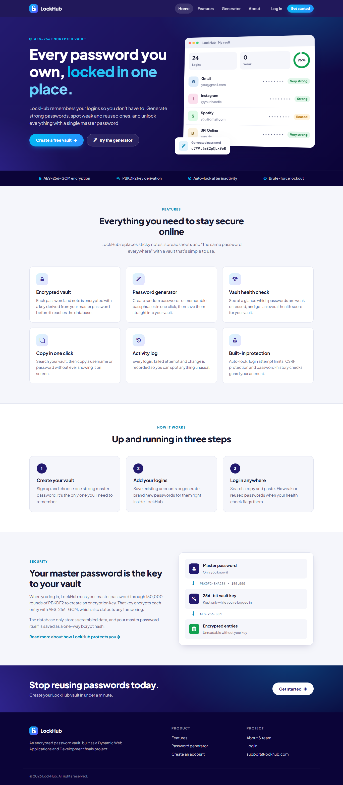
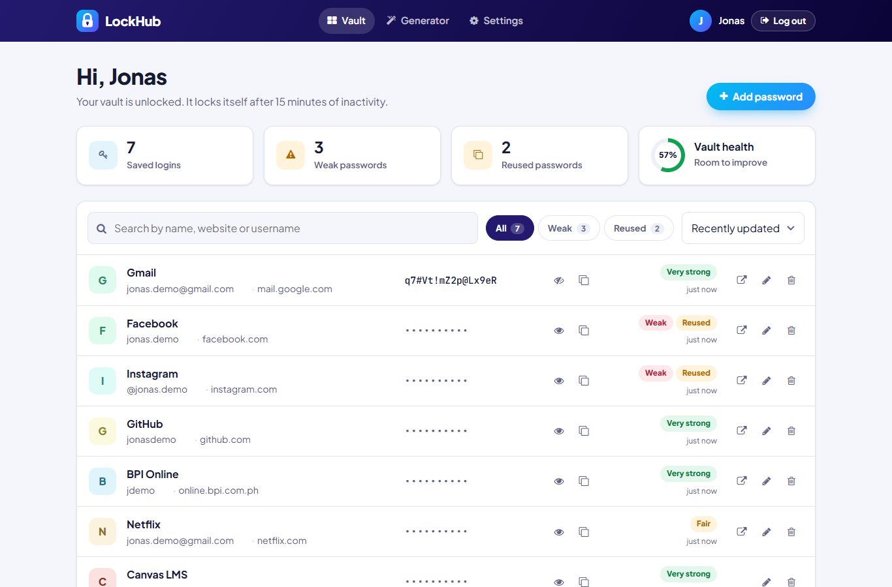
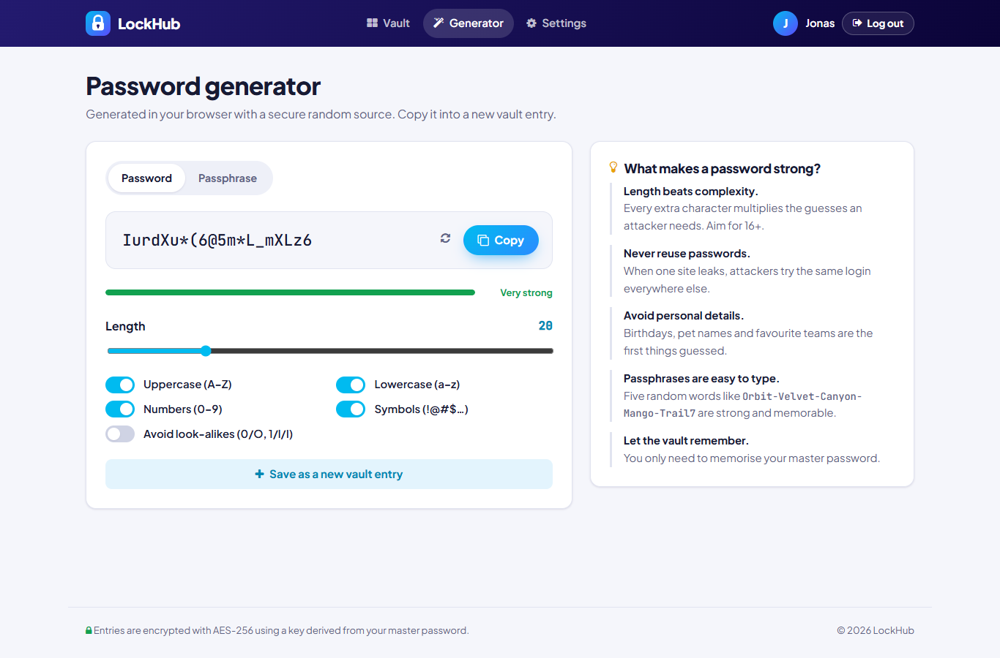
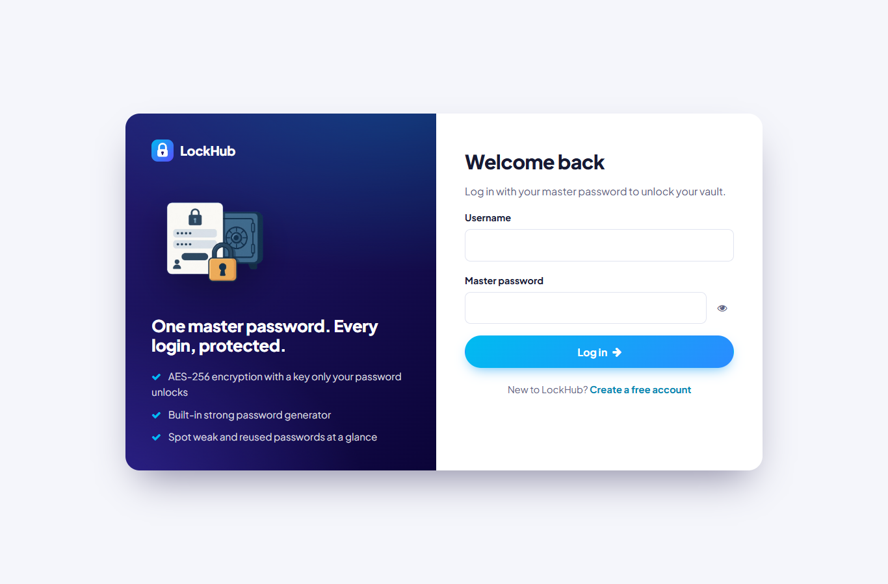
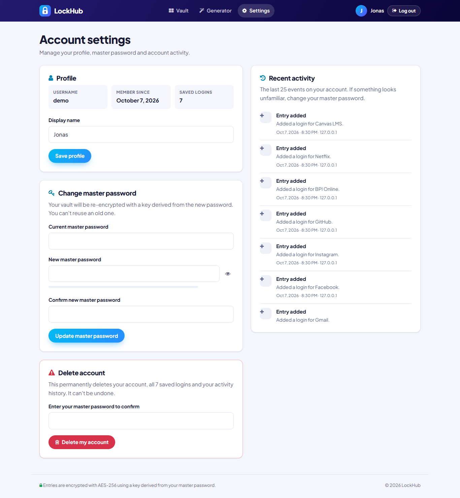
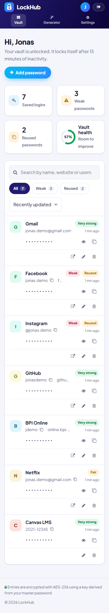

# LockHub

**An encrypted password manager built with PHP and MySQL.**

LockHub keeps your logins in a vault that's encrypted with a key only your master password can unlock. It also generates strong passwords and points out the weak or reused ones.

It's our finals project for Dynamic Web Applications and Development.

🌐 **Live site:** [lockhub.infinityfreeapp.com](https://lockhub.infinityfreeapp.com)



## Features

- **Encrypted vault:** save a name, website, username, password and private notes for each account. Passwords and notes are encrypted before they reach the database.
- **Search, filter and sort:** find any login instantly, or show only the weak or reused passwords.
- **One-click copy:** copy a username or password without showing it on screen. Passwords stay hidden until you click show, and hide themselves again after 20 seconds.
- **Vault health score:** every password gets a strength rating, reused passwords are flagged, and the whole vault gets a score out of 100%.
- **Password and passphrase generator:** set the length and character types, avoid look-alike characters, or switch to easy-to-type passphrases. It works without an account too.
- **Activity log:** logins, failed login attempts and every change to the vault are recorded with the time and IP address.
- **Account settings:** change your display name or master password, and delete your account and all its data.
- **Responsive design:** works on phones, tablets and desktops.

| Vault | Generator |
| --- | --- |
|  |  |

| Login | Settings | Mobile |
| --- | --- | --- |
|  |  |  |

## Security

| Protection | How |
| --- | --- |
| Vault encryption | AES-256-GCM with a fresh random IV per entry. GCM also detects tampering. |
| Vault key | Derived from the master password with PBKDF2-SHA256 (150,000 rounds, unique salt per user). It only exists in the session while you're logged in. |
| Master password | Stored as a bcrypt hash. Changing it re-encrypts the whole vault, and old master passwords can't be reused. |
| No passwords in page source | The vault page never contains decrypted passwords. Each one is fetched from `api.php` only when you click show or copy. |
| SQL injection | Every query uses prepared statements. |
| Access control | Every vault operation is limited to the logged-in user's own entries. |
| CSRF | All forms and API requests carry a per-session token. |
| XSS | All output is escaped. |
| Brute force | Five failed logins for the same username and IP lock that login for 15 minutes. |
| Idle sessions | The vault locks itself after 15 minutes of inactivity. |

> **Note:** because the vault key comes from your master password, a forgotten master password can't be recovered.

## Tech stack

- PHP 8 (mysqli, OpenSSL)
- MySQL / MariaDB
- HTML5, CSS3 and vanilla JavaScript (no frameworks)
- Font Awesome 4 icons, Plus Jakarta Sans font

## Running locally (XAMPP)

1. Install [XAMPP](https://www.apachefriends.org/) and start **MySQL** in the XAMPP Control Panel.
2. Start the site with either of these:
   - **Apache:** copy this folder to `C:\xampp\htdocs\LockHub`, start Apache, and open <http://localhost/LockHub/>.
   - **PHP's built-in server:** from this folder, run
     ```
     C:\xampp\php\php.exe -S localhost:8000
     ```
     and open <http://localhost:8000/>.
3. Click **Get started** to create an account.

You don't need to import anything. The `lockhub_db` database and its tables are created automatically on first use. The schema is in [`db/lockhub_db.sql`](db/lockhub_db.sql) if you want to look at it.

The default database settings (`localhost`, user `root`, no password) are in [`includes/config.php`](includes/config.php).

## Deploying to InfinityFree

1. Create a free hosting account at [infinityfree.com](https://www.infinityfree.com/) and open its **Control Panel**.
2. **MySQL Databases:** create a database (for example `lockhub`). Note the hostname, username, password and full database name shown under **MySQL Details**.
3. **File Manager:** open `htdocs`, delete the default `index2.html`, and upload the project files directly into `htdocs` (not into a subfolder). `README.md` and `docs/` don't need to be uploaded.
4. In `htdocs/includes`, copy `config.local.example.php` to `config.local.php` and fill in the four database values from step 2.
5. Open your site. The tables are created on the first visit.

**HTTPS (optional):** request the free SSL certificate in the InfinityFree client area. Once your site loads with `https://`, remove the `#` from the HTTPS block in [`.htaccess`](.htaccess) so every visit uses it.

> `config.local.php` holds your database password, so it's listed in `.gitignore` and is never committed.

## Project structure

```
LockHub/
├── index.php              Landing page
├── why.php                Features, security model and FAQ
├── about.php              Mission and team
├── generator.php          Password / passphrase generator
├── signup.php             Create an account
├── login.php              Log in (with brute-force lockout)
├── logout.php
├── home.php               The vault
├── account_settings.php   Profile, master password, activity, delete account
├── api.php                JSON endpoint that decrypts one entry on demand
├── db_conn.php            Database connection and automatic schema setup
├── includes/
│   ├── bootstrap.php      Sessions, CSRF, encryption, strength scoring, audit log
│   ├── layout.php         Shared header, navigation and footer
│   ├── config.php         Default settings
│   └── config.local.example.php
├── css/lockhub.css        Design system
├── js/lockhub.js          Generator, strength meter, vault interactions
├── db/lockhub_db.sql      Database schema (reference)
└── docs/screenshots/
```

## Team

| Name | Role |
| --- | --- |
| Anunciacion Adrian | Chief Security Officer |
| Bondoc Jonas | Data Encryption Specialist |
| Galang Raphael | UX/UI Design Lead |
| Antonio Charles | Cloud Integration Expert |
